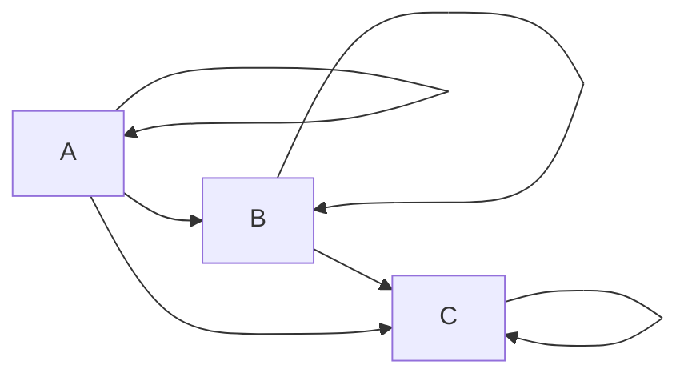

# Chapter 1 - Category: The Essence of Composition

**1. Implement, as best as you can, the identity function in your favorite language (or the second favorite, if your favorite language
happens to be Haskell).**

```csharp
public static A identity<A>(A a) => a;
```

**2. Implement the composition function in your favorite language. It
takes two functions as arguments and returns a function that is
their composition.**

```csharp
public static Func<A, C> compose<A, B, C>(Func<A, B> f, Func<B, C> g) => a => g(f(a));
```

**3. Write a program that tries to test that your composition function
respects identity.**

```csharp
Func<string, int> strLength = x => x.Length;

var test1 = compose(strLength, identity);
var test2 = compose<string, string, int>(identity, strLength);

var result = test1("HELLO") == 5 &&
             test2("HELLO") == 5 &&
             strLength("HELLO") == 5;

Console.WriteLine(result);
```

**4. Is the world-wide web a category in any sense? Are links morphisms?**

If it were a category with pages as objects and links as morphisms then:

- Each page would need to link to itself (identity)
- You would have to consider links as composable.

So it's not really category.

**5. Is Facebook a category, with people as objects and friendships as
morphisms?**

No because if:

`Person A is friends with Person B AND Person B is friends with Person C`

there is no guarantee that this can be composed to mean that Person A is friends with Person C.
Also identity would mean you are friends with yourself which is a bit strange.

**6. When is a directed graph a category?**

When there is an edge between each node and every subsequent one, so if

A --> B --> C 

then there would also need to be

A --> C

Each node would also need an edge that pointed back at itself.



